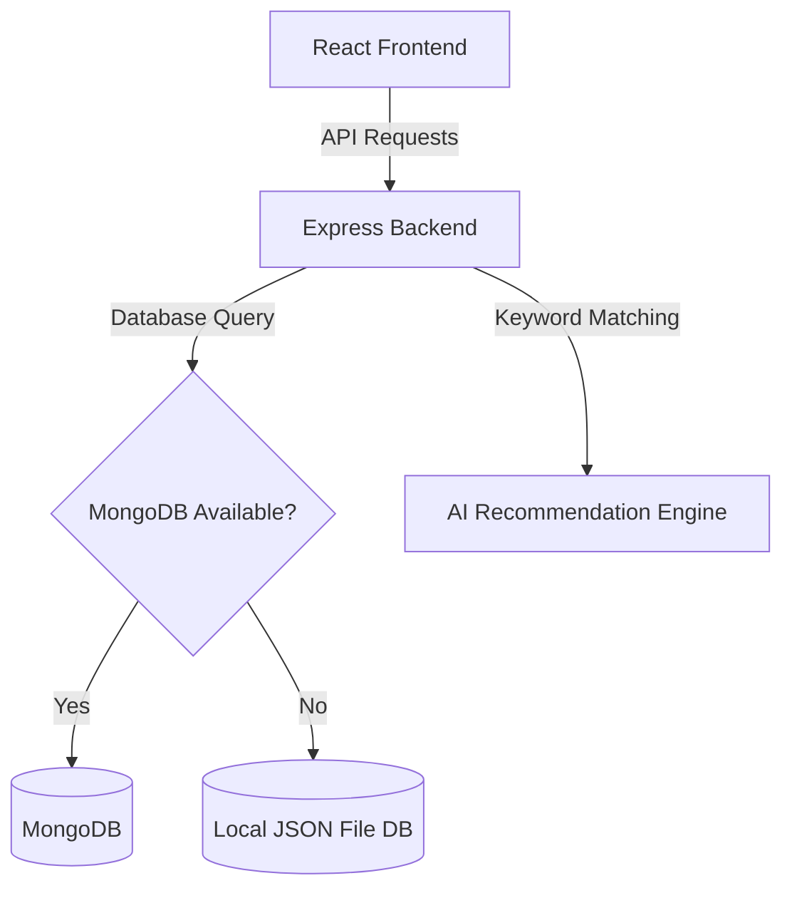

# Implementation Plan - Lost & Found Board

A full-stack, responsive web application for a campus Lost & Found system, featuring a modern aesthetic, Leaflet.js map interaction, item claims, notifications, and a keyword-matching AI suggestion engine.

---

## Workspace Setup

Since there is currently no active workspace, all code will be generated inside:
`C:\Users\User\.gemini\antigravity\scratch\lost-and-found-board`

We recommend setting this directory as your active workspace once it is created.

---

## User Review Required

> [!IMPORTANT]
> **Database Environment:** We will build the backend using Express.js and Mongoose (MongoDB). However, to guarantee that the application runs **out of the box** even if you do not have MongoDB running locally, we will implement a dynamic **database fallback mechanism**.
> - **MongoDB Mode (Default):** Connects to `mongodb://localhost:27017/lostfound` or a custom connection string in a `.env` file.
> - **Fallback JSON File-Based Database:** If MongoDB connection fails, the server will automatically switch to a localized file-based database (`backend/data/database_fallback.json`) for seamless local testing and zero setup.

---

## Proposed Changes

We will divide the project into two main directories under `lost-and-found-board/`:
1. `backend/`: Node.js, Express, Multer (image uploads), Mongoose/JSON DB interface, and simple AI match utility.
2. `frontend/`: React (Vite-based), Leaflet.js (maps), Vanilla CSS (custom design system, glassmorphism, responsive grid, smooth animations).

---

---

### Backend Component (`backend/`)

#### [NEW] [package.json](file:///C:/Users/User/.gemini/antigravity/scratch/lost-and-found-board/backend/package.json)
Contains backend dependencies: `express`, `mongoose`, `cors`, `dotenv`, `multer`, `jsonwebtoken`, `bcryptjs`.

#### [NEW] [server.js](file:///C:/Users/User/.gemini/antigravity/scratch/lost-and-found-board/backend/server.js)
The entry point of the Express server. Initializes database connection (with JSON fallback), middleware, routers, and listens on port 5000.

#### [NEW] [.env](file:///C:/Users/User/.gemini/antigravity/scratch/lost-and-found-board/backend/.env)
Contains configurations like `PORT=5000`, `MONGO_URI`, `JWT_SECRET`, and upload folder.

#### [NEW] [db.js](file:///C:/Users/User/.gemini/antigravity/scratch/lost-and-found-board/backend/config/db.js)
Handles MongoDB connection and exposes a database interface wrapper. If MongoDB fails, it configures a JSON-based database adapter that mimics mongoose models.

#### [NEW] [models.js](file:///C:/Users/User/.gemini/antigravity/scratch/lost-and-found-board/backend/models/models.js)
Defines schema for:
- **User:** `username`, `email`, `password`, `role` (user/admin), `createdAt`
- **Item:** `title`, `description`, `category`, `type` (lost/found), `date`, `location` (text description and GPS `{lat, lng}`), `imageUrl`, `status` (open, claimed, resolved), `userId`, `createdAt`
- **Claim:** `itemId`, `claimantId`, `ownerId`, `verificationAnswer`, `status` (pending, approved, rejected), `createdAt`
- **Notification:** `userId`, `message`, `type` (claim, match), `relatedId`, `read` (boolean), `createdAt`

#### [NEW] [aiEngine.js](file:///C:/Users/User/.gemini/antigravity/scratch/lost-and-found-board/backend/utils/aiEngine.js)
A utility to tokenize text, remove common stop-words, and calculate Jaccard keyword overlap scores between:
- A new **Lost** item vs existing **Found** items.
- A new **Found** item vs existing **Lost** items.
Generates automated match suggestions that trigger notifications.

#### [NEW] [routes.js](file:///C:/Users/User/.gemini/antigravity/scratch/lost-and-found-board/backend/routes/routes.js)
Implements endpoints:
- Auth: `/api/auth/register`, `/api/auth/login`, `/api/auth/me`
- Items: `/api/items` (GET filterable, POST with multer upload), `/api/items/:id` (GET, PUT status)
- Claims: `/api/claims` (POST submit claim, GET list, PUT status)
- Notifications: `/api/notifications` (GET list, PUT read status)
- AI Suggestions: `/api/items/:id/matches` (GET auto-suggest matches)

---

### Frontend Component (`frontend/`)

We will create a Vite + React project.

#### [NEW] [index.html](file:///C:/Users/User/.gemini/antigravity/scratch/lost-and-found-board/frontend/index.html)
Sets up page meta, imports Google Fonts (Outfit, Inter) and Leaflet CSS.

#### [NEW] [index.css](file:///C:/Users/User/.gemini/antigravity/scratch/lost-and-found-board/frontend/src/index.css)
The core design system containing custom HSL variables, smooth transitions, font family mappings, scrollbars, dark/light theme properties, and glassmorphic card stylings.

#### [NEW] [App.jsx](file:///C:/Users/User/.gemini/antigravity/scratch/lost-and-found-board/frontend/src/App.jsx)
Main Router and Layout controller, managing authentication state, active views (Dashboard, Post Item, Claim Board, Admin Panel, Profile), and Notification alerts.

#### [NEW] [Dashboard.jsx](file:///C:/Users/User/.gemini/antigravity/scratch/lost-and-found-board/frontend/src/components/Dashboard.jsx)
The main hub displaying:
- A Split View: Left side is search, filters, category selectors, and item list cards. Right side is an interactive Leaflet Map displaying markers of all active lost/found items.
- Smooth transition between list and detailed views.

#### [NEW] [PostItem.jsx](file:///C:/Users/User/.gemini/antigravity/scratch/lost-and-found-board/frontend/src/components/PostItem.jsx)
Form to create new items:
- Input title, description, category (Electronics, Keys, Documents, Clothing, etc.), type (Lost/Found), date.
- Pinpoint location directly on an interactive Leaflet Map.
- Upload item image (via file input with premium preview).
- Automatic AI match suggestion display upon submission.

#### [NEW] [ItemDetails.jsx](file:///C:/Users/User/.gemini/antigravity/scratch/lost-and-found-board/frontend/src/components/ItemDetails.jsx)
Detailed display of an item, its map pin, status, and:
- A **Claim Button** that triggers a modal to input a verification description (e.g., "Describe unique features or serial numbers of the item to claim").
- An **AI Suggestions Panel** listing potential matches with match scores.

#### [NEW] [ClaimModerator.jsx](file:///C:/Users/User/.gemini/antigravity/scratch/lost-and-found-board/frontend/src/components/ClaimModerator.jsx)
Lets item posters or Admins view claims on items. Shows claimant details, verification answers, and allows "Approve" (resolves item and marks returned) or "Reject".

#### [NEW] [AdminPanel.jsx](file:///C:/Users/User/.gemini/antigravity/scratch/lost-and-found-board/frontend/src/components/AdminPanel.jsx)
Simple moderation board for deletion or pinning featured reports, and a summary dashboard (total users, total items, active vs resolved claims).

---

## Verification Plan

### Automated Tests / Verification Command
Since we are building a full-stack Node + React app, we will verify:
1. Backend lint and execution: `node server.js`
2. Frontend bundling: `npm run build` inside frontend.
3. Server APIs using a verification script `scratch/verify_api.js` to trigger registration, listing, and posting to make sure endpoints respond properly.

### Manual Verification
1. User logs in.
2. User posts a "Lost Key with a black leather chain" at Campus Library on the map.
3. User logs in as another user, posts "Found leather keys chain near Library".
4. The system triggers a "Potential Match Found" notification, showing the score.
5. User claims the item, and the poster approves it, updating the status to "Resolved".
