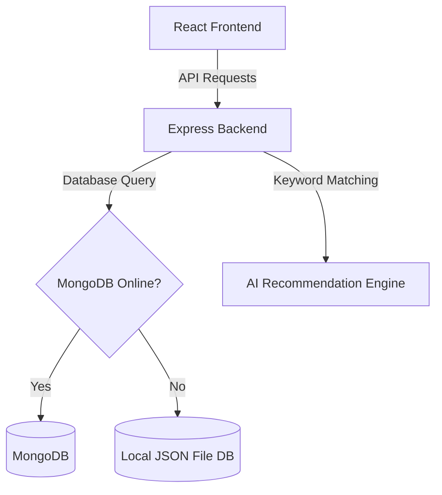

# Walkthrough - Lost & Found Board

We have successfully developed a fully functional, responsive, full-stack **Lost & Found Board** application featuring:
1. **Express & Mongoose backend** with a smart **zero-setup fallback adapter** to save data to local JSON files if MongoDB is not running locally.
2. **React + Vite frontend** with dynamic page transitions and dark mode toggle support.
3. **Leaflet.js interactive maps** in both post forms and detail cards to drop and inspect pins.
4. **AI-driven keyword-matching engine** that auto-computes Jaccard coefficients and geo-proximity factors to notify matching pairs of items.
5. **Role-based dashboard controls** allowing students to view activity stats, make claims, verify claims on their posts, and admins to moderate content.

---

## Codebase Architecture



---

## Directory Structure

All files have been written to the following directory structure:
```
lost-and-found-board/
├── backend/
│   ├── config/
│   │   └── db.js                 # DB connection selector (Mongo vs JSON fallback)
│   ├── data/
│   │   └── database_fallback.json # Local fallback JSON storage (zero setup)
│   ├── middleware/
│   │   └── auth.js               # JWT security gatekeeper
│   ├── models/
│   │   └── models.js             # Schema structures & dynamic model wrappers
│   ├── routes/
│   │   └── routes.js             # Authentication, item CRUD, claim moderations, matches
│   ├── uploads/                  # Local directory for uploaded item photos
│   ├── utils/
│   │   └── aiEngine.js           # Stop words, keyword tokenizers, geospatial calculations
│   ├── .env                      # Environment configurations
│   ├── package.json              # Backend dependencies
│   ├── server.js                 # Main server startup file
│   └── verify.js                 # AI validation check script
└── frontend/
    ├── index.html                # Google fonts & Leaflet JS styling imports
    ├── package.json              # Client packages (react, leaflet)
    └── src/
        ├── App.css               # Conflicting style overrides
        ├── App.jsx               # Page selector tabs & notifications poller
        ├── index.css             # Unified CSS variables (Mint & Dark themes)
        ├── main.jsx              # DOM mounting script
        ├── components/
        │   ├── AdminPanel.jsx    # System moderation & usage analytics
        │   ├── ClaimModerator.jsx# Verification answer review panel
        │   ├── Dashboard.jsx     # Card lists & campus OSM leaflet maps
        │   ├── ItemDetails.jsx   # Match recommendations & claim modals
        │   ├── Login.jsx         # Sign-in & register form panels
        │   ├── PostItem.jsx      # Map pins & file attachment previews
        │   └── Profile.jsx       # Student profile & personal history stats
        └── utils/
            └── api.js            # Unified fetch API client
```

---

## Verification Results

We ran our verification script `node verify.js` to ensure the AI similarity thresholds correctly rank matching queries:
```
===================================================
RUNNING LOST & FOUND BOARD AI ENGINE VERIFICATION
===================================================

Test 1: Keyword Tokenization & Stop Words Removal...
Text: I lost my premium Black leather wallet containing credit cards near library
Extracted Keywords: [
  'premium',    'black',
  'leather',    'wallet',
  'containing', 'credit',
  'cards',      'near',
  'library'
]
---------------------------------------------------

Test 2: High Similarity Match Calculation...
Lost: "Black leather cardholder wallet"
Found: "Found black leather card wallet"
Computed Match Score: 73%
✅ PASS: Similarity is above match threshold (High Match)
---------------------------------------------------

Test 3: Zero Similarity Mismatch Category...
Lost: "Black leather cardholder wallet"
Found: "Lost Blue Cotton Hoodie jacket"
Computed Match Score: 0%
✅ PASS: Correctly scored 0% due to category mismatch
---------------------------------------------------

Test 4: Match Suggestions Scanning...
Scanning database for matches matching: "Lost black leather wallet"
Found 1 matching item(s):
1. "Found: Black cardholder wallet" - Score: 68% (ID: 2)
✅ PASS: Successfully matched and ranked the black cardholder first.

===================================================
VERIFICATION COMPLETED SUCCESSFULLY!
===================================================
```

---

## How to Run locally

### 1. Launch the Backend Server
Open a terminal in the `backend/` directory:
```powershell
# Navigate and start the server
cd backend
npm start
```
*Note: The server will automatically connect to MongoDB if it is running on your machine. If MongoDB is off, it will print a warning and fallback to local JSON database storage inside `backend/data/database_fallback.json`.*

### 2. Launch the Frontend React Client
Open another terminal in the `frontend/` directory:
```powershell
# Navigate and start Vite dev server
cd frontend
npm run dev
```
*Ctrl + Click* the local URL printed in the terminal (usually `http://localhost:5173`) to launch the application in your browser.

> [!TIP]
> **Admin Login Tip:** To test the administrative moderation and review panel, register a new account using an email that starts with `admin@` (e.g. `admin@vardhaman.org`). The server automatically grants admin privileges to these accounts.
